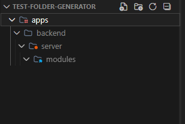

# Module Generator

This project was created in order to enhance the developer experience. Using the command line, you're able to generate a full module with the all main folders you need.

## Prerequisites
To ensure the generator works correctly, please follow these requirements:
- **Project Structure**: Your project **must** follow the hierarchy below
```text
apps/
  ├── backend/
        ├── server/
              ├── modules/
```  
Like this:              
 

- **Execution Path**: You must execute the command from the **root** of your project. _The script uses your current directory to locate the destination folders._

The new module will be automatically created inside the `modules` folder.

## How to use:
You can use this toll in two ways:

### 1. Direct command (NPX)
Run the following command in your terminal:
```bash
npx github:FelipePEduardo/folder-generator moduleName
```
**Note**: Replace `moduleName` with the actual name of the module you want to create.

### 2. Creating an Alias (Recommended)
To avoid typing the full command every time, you can create a shortcut:
  1. Open your terminal, type `code $PROFILE` (for PowerShell).
  2. Paste the following function into the file:
```PowerShell
function fg {
  npx github:FelipePEduardo/folder-generator @args
}
```
  3. Save and close the file.
  4. Restart your terminal or run `. $PROFILE` to apply the changes.
  5. Now, simply run:
```bash
fg moduleName
```

You can choose the function name, that will be the alias. Just remember to change the command when you need to execute it.
