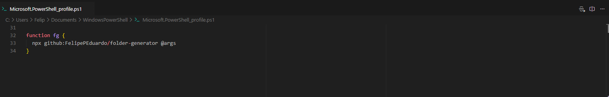

## Module Generator

To use this project you just need to run the command:

```bash
npx github:FelipePEduardo/folder-generator moduleName
```

Or you can create an alias to make it easier. Open your terminal, type `code $PROFILE`, press enter, in the openned file you just need to put this function: 

```bash
function fg {
  npx github:FelipePEduardo/folder-generator @args
}
```



You can choose the function name, that will be the alias.

To create the module you need to type the alias and the module name, for example:
```bash
fg moduleName
```